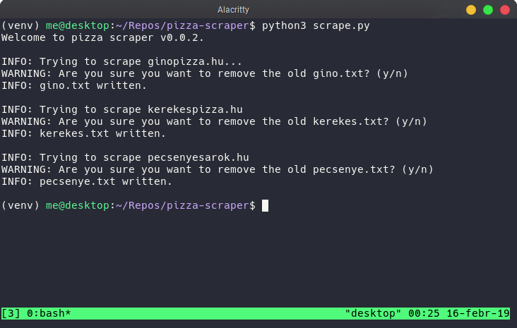

# Pizza scraper

This software takes a bunch of websites and tries to scrape
data off of them. For now it's "hardcoded", as in it contains
no machine-learning like stuff. This is needed for an other repo of mine.

# Contribute

```
git clone https://github.com/krook1024/pizza-scraper
cd pizza-scraper
python -m venv venv
. ./venv/bin/activate
pip install -r requirements.txt
```

# Screenshot

Screenshot of the program in action.


